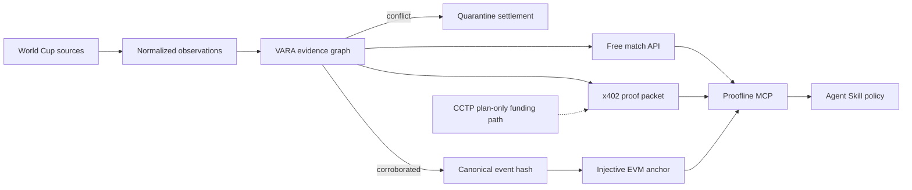

# Proofline

> **Don’t trust the score. Re-run the proof.**

Proofline is a conflict-aware match-verification and settlement layer for World
Cup products and AI agents. It turns attributed sports observations into a
reproducible evidence packet, holds automation when sources disagree, and
can anchor the final canonical hash on Injective EVM testnet.

The product is built around **VARA** — the Verifiable Autonomous Referee Agent.
Unlike a score widget with a blockchain button, VARA exposes the full decision
path: provenance, independence groups, disagreement, confidence inputs,
canonical event JSON, payment boundary, and on-chain commitment.

**Live demo:** [proofline.axiqo.xyz](https://proofline.axiqo.xyz) · The public
deployment is deliberately labelled **Historical Replay / Injective Demo / x402
Sandbox** until the dedicated testnet wallets are funded and the guarded
testnet runbook has produced public transaction evidence.

## The judge moment

Run the included historical replay of **Wales 0–2 IR Iran (25 Nov 2022)**. A
synthetic lagging feed changes Wayne Hennessey’s 86th-minute red card to yellow.
Proofline immediately pulls confidence back, marks the event `contested`, and
keeps settlement held. When the official corroboration arrives and the bad
claim is retracted, the same deterministic verifier recovers. Late goals,
full-time status, and a matching anchor finally open the settlement gate.

The fault is labelled synthetic everywhere. The football facts are sourced
from a fixed CC0 OpenFootball commit and an independently linked FIFA match
review; the replay is permanently labelled **Historical Replay · Not Live**.

## End-to-end product



## Competition fit

| Requirement | Proofline implementation | Judge proof |
| --- | --- | --- |
| Injective | Append-only `MatchProofRegistry` on Injective EVM testnet | Registry address and Blockscout transaction after deployment |
| x402 | `0.01` native testnet USDC proof resource with a policy-capped Agent flow | Initial `402`, payment requirements, then portable packet |
| USDC / CCTP | Plan-only Base Sepolia domain `6` → Injective domain `29` funding safety path | Route/approval policy; executable burn/attest/mint is not claimed |
| MCP Server | Domain tools for match lookup, event verification, settlement readiness, proof purchase, packet and anchor checks | Run tools from Claude, Cursor, or another MCP client |
| Agent Skill | Explicit source, settlement, spending, replay, and CCTP safety rules | Agent refuses low-confidence or non-final settlement |
| AI-native product | Machine-verifiable evidence and deterministic decisions, not a chat wrapper | Same packet verifies inside API, MCP, and independent code |

## Quick start

Requirements: Node.js 20+ and npm.

```bash
cp .env.example .env
npm install
npm run check
npm run dev
```

Open [http://localhost:5173](http://localhost:5173). The API listens on
`http://localhost:8787`. The default configuration is intentionally a no-key,
no-wallet sandbox: it runs the complete conflict replay, emits a real HTTP 402
negotiation shape, and produces an explicitly labelled deterministic demo
receipt. It never claims that sandbox payment or anchoring happened on-chain.

### Demo script

1. Reset the historical replay.
2. Run it and watch the red-card event move from `observed` to `contested`.
3. Inspect the exact conflicting field and source independence groups.
4. Let the replay reach full time, verification, and anchoring.
5. Request the premium proof: the first response is `402 Payment Required`.
6. Use the labelled sandbox signature to retrieve the packet locally.
7. Verify the packet, then modify one field and observe verification fail.

For the real testnet path, follow the guarded commands in the
[testnet runbook](docs/TESTNET_RUNBOOK.md). The deployment command fills the
registry address automatically; anchor and x402 payment commands remain
non-broadcasting until their action-specific flag and acknowledgement are both
present.

## Commands

```bash
npm run dev               # API + web control room
npm run check             # typecheck + tests + production builds
npm run compile:contract  # compile Solidity registry
npm run wallets:create:testnet # create isolated testnet-only wallets in .env
npm run deploy:contract   # deploy registry and atomically fill .env (broadcasts)
npm run testnet:preflight # read-only registry, role, balance and x402 checks
npm run testnet:api       # real anchor + official inline facilitator; no startup tx
npm run anchor:testnet    # prepare replay anchor; no tx unless explicitly approved
npm run buy:proof         # official Agent quote/sign-only; no payment by default
npm run mcp               # start the stdio MCP server
npm run smoke             # exercise replay, 402, packet and tamper rejection
```

## Verified locally

The current checkout has been validated with:

- `npm run check`: 34 passing checks — Core 7, API 18, MCP policy 3, contract
  artifact/interface guards 3, and guarded testnet workflow 3 — plus
  production builds and Solidity compilation.
- `npm audit`: 0 known vulnerabilities.
- `npm run smoke`: conflict at frame 4, final confidence `9649` bps,
  settlement open only after the matching demo anchor, 402 negotiation,
  packet verification, and tamper rejection.
- Live Chrome pass at `1920×1080`: complete 15-frame replay, settlement gate,
  and the full quote → sandbox report → recomputation flow. Responsive rules
  cover `720px` and `420px`, with motion disabled under
  `prefers-reduced-motion`.

## Repository map

```text
apps/web/           React control room and replay/proof experience
apps/api/           Replay engine, evidence API, anchoring and x402 boundary
packages/core/      Canonicalization, VARA verifier and portable proof packet
packages/mcp/       AI Agent-facing MCP tools and hard spending policy
contracts/          Injective EVM append-only proof registry and deploy script
skills/             Project-owned Agent Skill
data/replays/       Attributed, deterministic historical replay fixture
docs/               Architecture, trust, design and judging evidence
```

## Trust boundaries

- One source family never counts as multiple independent votes.
- A single source cannot reach `verified`.
- Any active incompatible claim forces `contested` and holds settlement.
- Each browser/MCP replay has an isolated session, so judges cannot reset one
  another's evidence state.
- Every 402 quote freezes a packet hash for five minutes; the paid retry is
  rejected before settlement unless its signed requirement carries that quote
  ID, so replay progress cannot swap the report after review.
- A final result requires a finished match, threshold confidence, no conflict,
  and a confirmed anchor for the same canonical hash.
- Real testnet verification checks registry identity, latest event-specific
  state, transaction target and decoded `anchorProof` calldata. Demo receipts
  never pass this public-chain check.
- Provider credentials and raw licensed payloads stay server-side.
- The chain proves a commitment and ordering, not sporting truth by itself.
- Demo and testnet paths are distinct machine-readable modes.
- CCTP is plan-only in this build; no burn, attestation, mint, or balance recheck
  is claimed.

See the [product specification](docs/PRODUCT_SPEC.md),
[architecture](docs/ARCHITECTURE.md), [trust model](docs/TRUST_MODEL.md),
[data provenance](docs/DATA_PROVENANCE.md), [visual system](docs/DESIGN.md), and
the [judge guide](docs/JUDGING.md) for the complete reasoning.

Production release assets for `proofline.axiqo.xyz` are documented in the
[CentOS deployment guide](deployment/README.md). The deployment uses a
loopback-only API, nginx, systemd, root-only environment file, checksum-verified
immutable releases, health-gated atomic switching, and rollback.

## Testnet configuration

Proofline targets Injective EVM testnet chain ID `1439` (`eip155:1439`) and
native testnet USDC. Copy `.env.example`, deploy the registry, and set:

```text
CHAIN_MODE=injective-testnet
PROOF_REGISTRY_ADDRESS=0x...
ANCHOR_PRIVATE_KEY=0x...
X402_MODE=injective-testnet
X402_PAY_TO=0x...
X402_FACILITATOR_PRIVATE_KEY=0x...
```

Use funded testnet-only wallets. Never commit `.env`.

After completing the replay, `npm run buy:proof` uses the official Injective
x402 client to quote, policy-check, and sign an EIP-3009 authorization with the
dedicated `X402_AGENT_PRIVATE_KEY`, but keeps it in memory by default. A real
settlement additionally requires `--pay` and the exact ephemeral acknowledgement
documented in the testnet runbook. It refuses any origin, redirect, chain,
asset, payee, frozen packet hash, or price outside the allowlist in `.env`.

## License

Project code is MIT licensed. Replay data attribution and third-party terms are
documented separately in [data provenance](docs/DATA_PROVENANCE.md).
