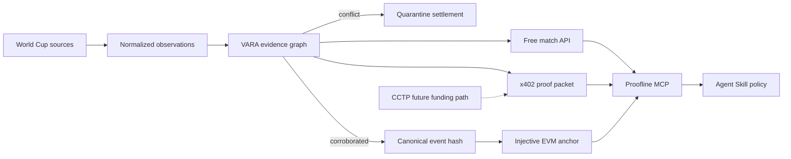

# Proofline

> **Don’t trust the score. Re-run the proof.**

Proofline is a conflict-aware match-verification and settlement layer for World
Cup products and AI agents. It turns attributed sports observations into a
reproducible evidence packet, holds automation when sources disagree, and
anchors the final canonical hash on Injective EVM testnet.

The product is built around **VARA** — the Verifiable Autonomous Referee Agent.
Unlike a score widget with a blockchain button, VARA exposes the full decision
path: provenance, independence groups, disagreement, Evidence Score inputs,
canonical event JSON, payment boundary, and on-chain commitment.

**Hosted demo:** [proofline.axiqo.xyz](https://proofline.axiqo.xyz) ·
**GitHub:** [a252937166/proofline](https://github.com/a252937166/proofline) ·
**Immutable release:** [`global-cup-final-v2`](https://github.com/a252937166/proofline/releases/tag/global-cup-final-v2)

## Judge entry points

| Path | Direct link | What it proves |
| --- | --- | --- |
| Real wallet test | [Wallet → Review → Sign → Verify](https://proofline.axiqo.xyz/?case=WC-2026-M97-FRA-MAR&experience=wallet) | Built-in `0.02` test-USDC funding when needed, a real `0.01` quote, two explicit wallet signatures for one payment, a receipt, and three independent verification layers |
| No-wallet audit | [Verify the published packet](https://proofline.axiqo.xyz/?case=WC-2026-M97-FRA-MAR&experience=audit) | Recompute packet integrity, issuer trust, and the latest Registry v3 commitment without a new wallet request or payment |
| Conflict replay | [Watch conflict quarantine](https://proofline.axiqo.xyz/?case=WC-2022-WAL-IRN&experience=replay) | Reproduce a disclosed bad-source claim, settlement hold, correction, and deterministic recovery |

The paid judge path is deliberately not a one-click action. **Wallet** performs
the testnet preflight, **Review** exposes the unsigned HTTP 402 terms, **Sign**
requests two explicit confirmations that produce one bound payment
authorization, and **Verify** independently checks packet integrity, the trusted
issuer, and the latest Injective commitment.

The wallet sheet accepts any compatible injected EIP-6963/EIP-1193 provider.
If an account has less than the proof price, a dedicated, rate-limited testnet
dispenser can send exactly `0.02` canonical test USDC, link the Blockscout
receipt, and refresh the displayed balance. It never accepts a browser-supplied
amount, token, or network.

## Final release identity

`global-cup-final-v2` is the immutable judge release. The submission is treated
as frozen only when every row below resolves to the same final source revision;
the table is an acceptance gate, not a claim about an unverified deployment.

| Surface | Stable evidence | Final-freeze requirement |
| --- | --- | --- |
| Source release | [`global-cup-final-v2`](https://github.com/a252937166/proofline/releases/tag/global-cup-final-v2) | The tag resolves to the final submitted source revision and is never moved |
| CI | [Proofline CI](https://github.com/a252937166/proofline/actions/workflows/ci.yml) | The run for that release revision passes `npm run check` and `npm audit --audit-level=high` |
| Live build | [`/release.json`](https://proofline.axiqo.xyz/release.json) and the page Footer | `sourceCommit` and the displayed commit resolve to the release tag; the release ID identifies `global-cup-final-v2` |
| Downloadable artifacts | [GitHub Release assets](https://github.com/a252937166/proofline/releases/tag/global-cup-final-v2) | API and Web archives carry the same release ID and publish matching SHA-256 manifests |

## Public Injective testnet proof

The complete paid-proof path was executed on Injective EVM testnet
(`eip155:1439`) on 11 July 2026:

| Evidence | Public result |
| --- | --- |
| Registry v3 | [`0x380D75d068dec45D8145ef89B7A40a6201Ac1ef1`](https://testnet.blockscout.injective.network/address/0x380D75d068dec45D8145ef89B7A40a6201Ac1ef1?tab=contract) — source **fully verified**, Solidity `0.8.35` |
| Deploy | [`0xdf71…9523`](https://testnet.blockscout.injective.network/tx/0xdf71a0e7fce722bfdc39b58951f6548ef07b6d06cb101aa57bc51a5566979523) |
| Grant anchorer role | [`0x5858…acb4`](https://testnet.blockscout.injective.network/tx/0x58587a0d751248b714a6232cc75618762e02ff355aba00fa28d79216f252acb4) |
| Anchor `WC-2026-M97-FRA-MAR` final result | [`0x24cd…7344`](https://testnet.blockscout.injective.network/tx/0x24cd0ae9a40dbfdba14563f9f2932451624be63928667b629c4cadc86a507344) |
| x402 settlement, `0.01` test USDC | [`0x2923…842e`](https://testnet.blockscout.injective.network/tx/0x29237a0a3d501ca62882042313fcbb730fd91d152967430b2600545a227b842e) |

This 2026 purchase moved the payer from `19.99` to `19.98` test USDC and the
payee from `20.01` to `20.02`. The complete public packet, issuer signature,
anchor, purchase-binding hash, and receipt are available as the
[no-wallet featured sample](data/evidence/featured-proof.json).

## The judge moment

The default case is the real 2026 delayed result **France 2–0 Morocco**. Its
ESPN and FIFA observations converge into evidence root
`0xe048…61b3`, which is anchored and sold through the real testnet path above.
Then run the secondary historical replay of **Wales 0–2 IR Iran (25 Nov 2022)**. A
synthetic lagging feed changes Wayne Hennessey’s 86th-minute red card to yellow.
Proofline immediately pulls the Evidence Score back, marks the event `contested`, and
keeps settlement held. When the official corroboration arrives and the bad
claim is retracted, the same deterministic verifier recovers. Late goals,
full-time status, and a matching anchor finally open the settlement gate.

The fault is labelled synthetic everywhere. The football facts are sourced
from a fixed CC0 OpenFootball commit and an independently linked FIFA match
review; the replay is permanently labelled **Historical Replay · Not Live**.

The product also exposes two honest 2026 data modes. `WC-2026-M97-FRA-MAR` is
a delayed, post-match France 2–0 Morocco snapshot with ESPN and FIFA provenance.
`WC-2026-M99-NOR-ENG` and `WC-2026-M100-ARG-SUI` are scheduled fixtures with
`score=null`; they are never presented as live matches. The deterministic 2022
replay remains the reproducible conflict-control path, while the 2026 result is
the primary proof, anchor, x402, and fresh-verification path.

## End-to-end product



## Competition fit

| Requirement | Proofline implementation | Judge proof |
| --- | --- | --- |
| Injective | Append-only `MatchProofRegistry` on Injective EVM testnet | Fully verified contract, deployment, role grant, and real anchor linked above |
| x402 | `0.01` native testnet USDC proof resource with a policy-capped Agent flow | Real successful settlement plus payer/payee balance deltas linked above |
| USDC / CCTP | Native testnet USDC payment is executed; CCTP is future work | No burn, attestation, or mint transaction is claimed |
| MCP Server | Ten domain tools for match lookup, event verification, settlement readiness, proof purchase, packet and anchor checks | Stdio runtime plus committed official Injective MCP execution evidence |
| Agent Skill | Explicit source, settlement, spending, replay, and CCTP safety rules | Agent refuses low-score or non-final settlement |
| AI-native product | Machine-verifiable evidence and deterministic decisions, not a chat wrapper | Packet integrity, trusted issuer signature, and latest on-chain commitment verify independently |

## Quick start

Requirements: Node.js 20+ and npm.

```bash
cp .env.example .env
npm install
npm run check
npm run dev
```

Open [http://localhost:5173](http://localhost:5173). The API listens on
`http://localhost:8787`. The page opens on the 2026 France–Morocco delayed
snapshot and exposes its two source lanes without claiming a live feed. The
default configuration is intentionally a no-key, no-wallet sandbox: the
secondary 2022 conflict-control flow emits a real HTTP 402 negotiation shape
and an explicitly labelled deterministic demo receipt. It never claims that
sandbox payment or anchoring happened on-chain.

### Conflict replay script

1. Reset the historical replay.
2. Run it and watch the red-card event move from `observed` to `contested`.
3. Inspect the exact conflicting field and source independence groups.
4. Let the replay reach full time, verification, and anchoring.
5. Request the premium proof: the first response is `402 Payment Required`.
6. Use the labelled sandbox signature to retrieve the packet locally.
7. Inspect its three verification layers, then modify one field and observe
   packet integrity fail.

For the real testnet path, follow the guarded commands in the
[testnet runbook](docs/TESTNET_RUNBOOK.md). The deployment command fills the
registry address automatically; anchor and x402 payment commands remain
non-broadcasting until their action-specific flag and acknowledgement are both
present.

## Commands

```bash
npm run dev               # API + web control room
npm run check             # typecheck + tests + production builds
npm run compile:contract  # compile Solidity registry
npm run wallets:create:testnet # create isolated testnet-only wallets in .env
npm run deploy:contract   # deploy registry and atomically fill .env (broadcasts)
npm run verify:contract:testnet # publish and verify exact compiler input
npm run testnet:preflight # read-only registry, role, balance and x402 checks
npm run testnet:api       # real anchor + official inline facilitator; no startup tx
npm run anchor:testnet    # prepare replay anchor; no tx unless explicitly approved
npm run buy:proof         # official Agent quote/sign-only; no payment by default
npm run evidence:publish-sample # publish a settled packet without its payment signature
npm run mcp               # start the stdio MCP server
npm run smoke             # exercise replay, 402, packet and tamper rejection
```

## Verification model

`96.49/100` is an **Evidence Score**, not a probability that an event is true.
It is a deterministic policy score built from source reliability, independent
quorum, agreement, freshness, and conflict penalties. Only one strongest
representative per `independenceGroup` can affect candidate ranking and score;
duplicating one upstream feed 100 times adds no voting weight.

Every premium packet is checked at three independent layers:

1. **Packet integrity:** recompute canonical event JSON, `eventHash`,
   `evidenceRoot`, policy result, and `packetHash`.
2. **Trusted issuer:** recover the EIP-712 signer and require it to match the
   configured trusted issuer, not merely any cryptographically valid signer.
3. **Latest on-chain commitment:** read the match-wide latest registry revision
   and match its event hash, evidence root, score, and valid state. A later
   dispute or rejection invalidates an older proof for settlement.

Run `npm run check` for type checks, unit/integration tests, real-EVM contract
tests, browser tests, production builds, and Solidity compilation. `npm run
smoke` exercises conflict, recovery, proof negotiation, verification, and
tamper rejection locally.

## Repository map

```text
apps/web/           React control room and replay/proof experience
apps/api/           Replay engine, evidence API, anchoring and x402 boundary
packages/core/      Canonicalization, VARA verifier and portable proof packet
packages/mcp/       AI Agent-facing MCP tools and hard spending policy
contracts/          Injective EVM append-only proof registry and deploy script
skills/             Project-owned Agent Skill
data/replays/       Attributed, deterministic historical replay fixture
docs/               Architecture, trust, design and judging evidence
```

## Trust boundaries

- One source family never counts as multiple independent votes.
- A single source cannot reach `verified`.
- Any active incompatible claim forces `contested` and holds settlement.
- Each browser/MCP replay has an isolated session, so judges cannot reset one
  another's evidence state.
- Every 402 quote freezes a packet hash for five minutes; the paid retry is
  rejected before settlement unless its signed requirement carries that quote
  ID, so replay progress cannot swap the report after review.
- Signed payments are journaled by session, packet, payer, and EIP-3009 nonce.
  Concurrent duplicates are locked, settled retries are served from cache, and
  uncertain outcomes remain pending across restarts instead of charging again.
- A second `ProofPurchase` EIP-712 signature binds `packetHash`, payer, payee,
  amount, deadline, USDC nonce, and browser session. The UI requests it from a
  separate, explicit page click so compatible browser wallets surface
  confirmation `2/2`; signature `1/2` remains in memory and no payment header
  is submitted between the two. The flow is provider-neutral and falls back to
  generic wallet copy when the injected provider cannot be identified.
- Wallet selection uses EIP-6963 discovery with a standards-based
  `window.ethereum` fallback. Provider name and icon are rendered from the
  wallet the user actually selects; Proofline does not privilege or require a
  wallet brand.
- The browser persists only a high-entropy, non-spendable recovery capability,
  never `PAYMENT-SIGNATURE`. A settled report can be restored after reload or a
  Chrome restart without opening a wallet or calling the facilitator.
- Legacy packets affected by the historical replay-clock issuance bug may be
  reissued without repayment only when the original integrity/current-issuer
  signature passes, the issuer-time failure is the sole failed check, payment
  chronology is valid, and a fresh Injective registry lookup matches. The paid
  packet hash and replacement packet hash remain explicitly separate.
- Frozen packet JSON and entitlement state are atomically persisted with mode
  `0600`, so a restart cannot regenerate a different packet for a settled quote.
- Registry v3 has one concurrency-aware writer, `appendRevision`; the shortcut
  writer is removed and a `Final` decision is fully immutable.
- A final result requires a finished match, threshold Evidence Score, no conflict,
  and a confirmed anchor for the same canonical hash.
- Real testnet verification checks registry identity and the match-wide latest
  revision. Demo receipts never pass this public-chain check.
- Provider credentials and raw licensed payloads stay server-side.
- The chain proves a commitment and ordering, not sporting truth by itself.
- Demo and testnet paths are distinct machine-readable modes.
- CCTP is future work; no burn, attestation, mint, or balance recheck is claimed.

See the [product specification](docs/PRODUCT_SPEC.md),
[architecture](docs/ARCHITECTURE.md), [trust model](docs/TRUST_MODEL.md),
[data provenance](docs/DATA_PROVENANCE.md), [visual system](docs/DESIGN.md), and
the [judge guide](docs/JUDGING.md) for the complete reasoning.

Production release assets for `proofline.axiqo.xyz` are documented in the
[CentOS deployment guide](deployment/README.md). The deployment uses a
loopback-only API, nginx, systemd, root-only environment file, checksum-verified
immutable releases, health-gated atomic switching, and rollback.

## Testnet configuration

Proofline targets Injective EVM testnet chain ID `1439` (`eip155:1439`) and
native testnet USDC. Copy `.env.example`, deploy the registry, and set:

```text
CHAIN_MODE=injective-testnet
PROOF_REGISTRY_ADDRESS=0x...
ANCHOR_PRIVATE_KEY=0x...
X402_MODE=injective-testnet
X402_PAY_TO=0x...
X402_FACILITATOR_PRIVATE_KEY=0x...
# Optional judge funding path; use an isolated testnet-only wallet.
PROOFLINE_TEST_USDC_DISPENSER_ENABLED=true
PROOFLINE_TEST_USDC_DISPENSER_PRIVATE_KEY=0x...
PROOFLINE_TEST_USDC_DISPENSER_IP_HASH_KEY=...
PROOFLINE_TEST_USDC_DISPENSER_STATE_FILE=/absolute/root-only/path.json
```

Use funded testnet-only wallets. Never commit `.env`.

After completing the replay, `npm run buy:proof` uses the official Injective
x402 client to quote, policy-check, and sign an EIP-3009 authorization with the
dedicated `X402_AGENT_PRIVATE_KEY`, but keeps it in memory by default. A real
settlement additionally requires `--pay` and the exact ephemeral acknowledgement
documented in the testnet runbook. It refuses any origin, redirect, chain,
asset, payee, frozen packet hash, or price outside the allowlist in `.env`.

## Agent execution evidence

Proofline's stdio MCP exposes ten narrow tools, from `list_matches` and
`verify_event` through `purchase_match_proof` and `verify_onchain_anchor`. The
repository also contains a reproducible, sanitized execution transcript from
the official Injective MCP at pinned commit
`f5af39367975872a85b5447cefc9a197f2e635ea`: it listed 37 tools and successfully
executed `address_normalize`, `usdc_native_info`, and `account_balances` on
testnet; the balance call reports the payer's real testnet holdings. See
[evidence/agent/official-injective-mcp.json](evidence/agent/official-injective-mcp.json)
and [the capture script](scripts/capture-official-injective-mcp.ts). A second
transcript records five real calls through Proofline's own ten-tool MCP,
including a fresh revision-1 `verify_onchain_anchor` read:
[evidence/agent/proofline-mcp-testnet.json](evidence/agent/proofline-mcp-testnet.json).

## License

Project code is MIT licensed. Replay data attribution and third-party terms are
documented separately in [data provenance](docs/DATA_PROVENANCE.md).
